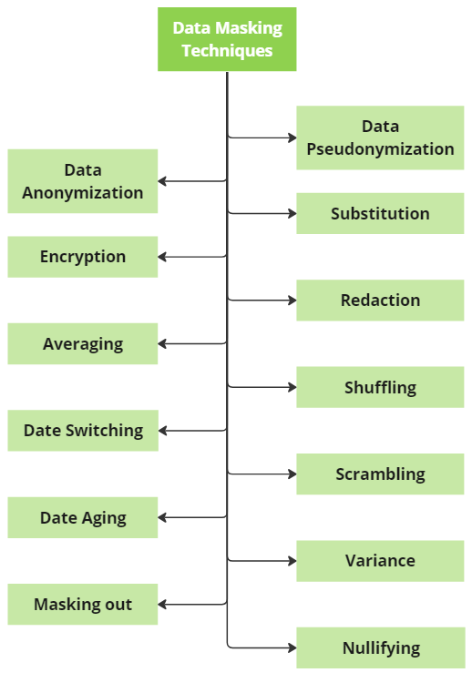

# Percona Data Masking Tutorial

จะประกอบไปด้วยเนื้อหาพื้นฐานและ การทำ masking เบื้องต้น

## Course Overview

- [Percona Data Masking Tutorial](#percona-data-masking-tutorial)
    - [Concept](#concept)
    - [Data Masking Technique](#data-masking-technique)
    - [Docker](#docker)
---

## Concept

Data Masking คือกระบวนการปกปิดข้อมูลของ user ที่เป็นข้อมูลที่ละเอียดอ่อนที่ในบางครั้งผู้ใช้งานอาจไม่ต้องการที่จะเผยแพร่ออกมา

โดยตัว Percona นั้นมี Plugin data masking ที่เป็นฟรี open souce ลองรับการใช้งานอยู่

โดย Percona นั้นจะครอบคลุมการใช้งานอยู่สองแบบ 

1. สร้างข้อมูลแบบใหม่โดยการสุ่ม เช่น สุม อีเมล
2. ปกปิดข้อมูลด้วยการ ซ่อนข้อมูล เช่น mask ข้อมูล เบอร์มือถือ 08x-xxx-xxxx

---

## Data Masking Technique 

โดยตัวของ Data Masking นั้นจะมีหลายวิธีหรือเทคนิคที่ใช้เพื่อปิดบังข้อมูลที่ละเอียดอ่อน

โดยหลักๆจะมีอยู่ 13 วิธี



---

## Docker

ติดตั้ง Docker image

``````markdown
docker pull percona/percona-server:8.0
``````

สร้าง Docker Container ของ Server Percona

```rust
docker run --name container-name -e MYSQL_ROOT_PASSWORD=secret -d percona/percona-server:tag
```
โดย container-name คือชื่อ container ที่ต้องการ PASSWORD=secret secret คือรหัสผ่าน และ tag คือ tag ของตัวนั้น

เช็ค Container ID เพื่อใช้เข้า Database

```rust
docker ps
```
เข้า docker container
```rust
docker exec -it Container-id bash
```
โดย container-id ก็คือ container id ที่เราต้องการ

เข้าไปใน mysql

```rust
mysql -uroot -proot
```
